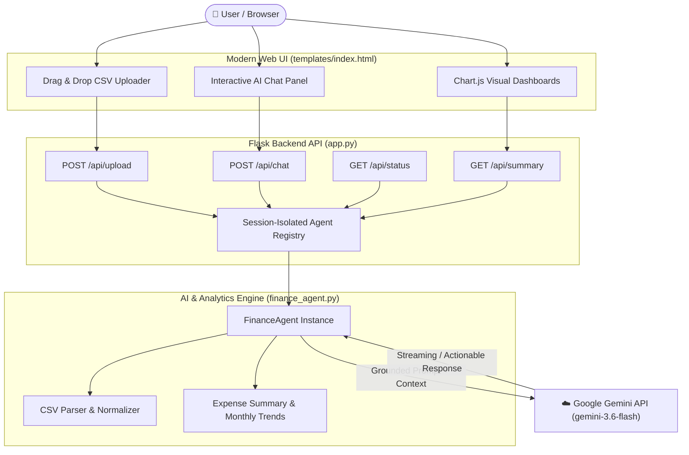

# 💰 Personal Finance Planner

<div align="center">


**An intelligent, data-grounded personal finance assistant powered by Google Gemini AI and Flask.**  
Upload your expense CSV to get real-time spending insights, interactive charts, and contextual AI advisory.

[Features](#-key-features) • [Quick Start](#-quick-start) • [CSV Specification](#-csv-data-specification) • [API Reference](#-api-endpoints) • [Architecture](#-architecture)

</div>

---

## 🌟 Key Features

### 🤖 Grounded AI Financial Advisor
- **Context-Aware Insights**: Backed by Google Gemini (`gemini-3.6-flash`), the agent delivers recommendations strictly grounded in your actual uploaded financial numbers.
- **Multi-Turn Conversation**: Maintains up to 20 rolling conversation turns with smart pruning so you can ask natural follow-up questions.
- **Scenario Simulation**: Ask "what-if" questions like *"What if I reduce dining out by 20%?"* and receive exact dollar savings projections.

### 📊 Dynamic Visual Dashboards
- **Category Donut Chart**: Visual breakdown of total spending across essential and discretionary categories.
- **Top Expense Ranking**: Horizontal bar chart highlighting highest expenditure categories.
- **Monthly Spending Trends**: Chronological trend analysis showing spending velocity month-over-month.
- **KPI Summary Cards**: Total spend, transaction count, average transaction size, top category, and date ranges at a glance.

### ⚡ Robust Data Ingestion
- **Flexible CSV Parsing**: Case-insensitive column matching with auto-strip for whitespace and currency symbols (`$`, `₹`, `€`, `£`, `¥`, `₩`, `₺`, `₱`).
- **Multi-Format Date Normalization**: Seamlessly handles `YYYY-MM-DD`, `DD/MM/YYYY`, `MM/DD/YYYY`, `DD-MM-YYYY`, `YYYY/MM/DD`, and more.
- **Validation & Security**: Built-in 5MB upload limits, character encoding fallbacks (`utf-8`, `latin-1`, `cp1252`), and strict CSV row validation.

### 🔒 Session-Isolated Architecture
- **Multi-User Privacy**: Each browser session gets an isolated `FinanceAgent` instance in memory.
- **State Restoration**: Reconnecting or refreshing automatically restores session state and expense statistics via `/api/status`.

---

## 🏗️ Architecture



---

## 📁 Repository Structure

```text
Personal-Finance-Planner/
├── app.py                     # Flask REST API server and session management
├── finance_agent.py           # Core FinanceAgent class, CSV analytics & Gemini integration
├── templates/
│   └── index.html             # Responsive dark UI with Chart.js & Marked.js
├── uploads/                   # Upload directory for temporary CSV processing
│   └── .gitkeep               # Git placeholder for uploads directory
├── .env.example               # Example environment variables template
├── .gitignore                 # Files and patterns excluded from version control
├── requirements.txt           # Python package dependencies
├── Test_Question.txt          # Curated test prompts across 5 evaluation categories
├── commit.md                  # Development commit plan & workflow reference
└── README.md                  # Project overview, documentation, and setup guide
```

---

## 🚀 Quick Start

### 1. Prerequisites
- **Python 3.10+** installed on your system.
- A **Google Gemini API Key** from [Google AI Studio](https://aistudio.google.com/).

### 2. Clone the Repository
```bash
git clone https://github.com/Krish-Bavariya/Personal-Finance-Planner-.git
cd Personal-Finance-Planner-
```

### 3. Create and Activate Virtual Environment
```bash
# Windows (PowerShell)
python -m venv venv
.\venv\Scripts\Activate.ps1

# Linux / macOS
python3 -m venv venv
source venv/bin/activate
```

### 4. Install Dependencies
```bash
pip install -r requirements.txt
```

### 5. Configure Environment Variables
Copy `.env.example` to `.env` and add your Gemini API key:
```bash
# Windows
Copy-Item .env.example .env

# Linux / macOS
cp .env.example .env
```

Edit `.env`:
```env
GEMINI_API_KEY=your_actual_gemini_api_key_here
FLASK_SECRET_KEY=your_random_secret_key_here
```

### 6. Run the Application

#### 🌐 Web Interface Mode:
```bash
python app.py
```
Open your browser and navigate to: **`http://localhost:5000`**

#### 💻 CLI Interactive Mode:
```bash
# Run with sample data:
python finance_agent.py

# Run with a custom CSV:
python finance_agent.py path/to/your/expenses.csv
```

---

## 📊 CSV Data Specification

The CSV parser requires four basic columns (case-insensitive):

| Column | Type | Accepted Formats | Description |
| :--- | :--- | :--- | :--- |
| `date` | String / Date | `YYYY-MM-DD`, `DD/MM/YYYY`, `MM/DD/YYYY`, `DD-MM-YYYY` | Transaction date |
| `amount` | Number | `45.50`, `$1,200.00`, `₹450`, `£12.99`, `¥5000` | Expense amount |
| `category` | String | `Food & Dining`, `Rent`, `Utilities`, `Entertainment` | Expense category |
| `description` | String | `Grocery Store`, `Electric Bill`, `Cinema Tickets` | Note or merchant info |

### Sample CSV Format
```csv
date,amount,category,description
2026-01-05,1200.00,Housing,Monthly Apartment Rent
2026-01-07,85.50,Groceries,Weekly Supermarket Run
2026-01-10,45.00,Utilities,Water & Electricity Bill
2026-01-15,15.99,Subscriptions,Streaming Service
2026-01-20,62.30,Dining Out,Dinner with Friends
```

---

## 🔌 API Endpoints

| Endpoint | Method | Payload / Params | Description |
| :--- | :--- | :--- | :--- |
| `/` | `GET` | — | Serves the main HTML single-page dashboard |
| `/api/upload` | `POST` | `multipart/form-data` (`file`) | Validates CSV, extracts expenses, returns summary & currency |
| `/api/chat` | `POST` | `{"message": "string"}` | Sends question to Gemini agent, returns AI analysis |
| `/api/status` | `GET` | — | Returns session state (`data_loaded`, `filename`, `message_count`) |
| `/api/summary` | `GET` | — | Returns complete aggregate metrics and category breakdown |
| `/api/reset` | `POST` | — | Clears conversational memory while retaining expense data |

---

## 💡 Example Queries to Try

Test the intelligence and grounding of the agent with queries such as:

- 📊 **Data Grounding**: *"What is my total spending and how many transactions do I have?"*
- 🏆 **Category Breakdown**: *"Which category did I spend the most on and what percentage of total spend is it?"*
- 📈 **Trend Analysis**: *"Which month had the highest spending and what caused the spike?"*
- 🎯 **Budget Planning**: *"What percentage of my budget goes to essential needs vs discretionary wants?"*
- 🔮 **Savings Simulation**: *"If I cut my top spending category by 25%, how much will I save each month?"*
- 🔄 **Follow-up Context**: *(After asking about highest category)* *"How does that compare to the second highest?"*

---

## 🛡️ Security & Best Practices

- **Never commit `.env`**: Keep API keys private. `.env` is listed in `.gitignore`.
- **Session Isolation**: User data remains strictly scoped to individual session IDs and is not persisted across users.
- **Upload Hygiene**: Uploaded files are capped at 5MB and sanitized before processing.

---

## 📄 License

This project is licensed under the **MIT License**. Feel free to use, modify, and distribute for personal or commercial projects.
